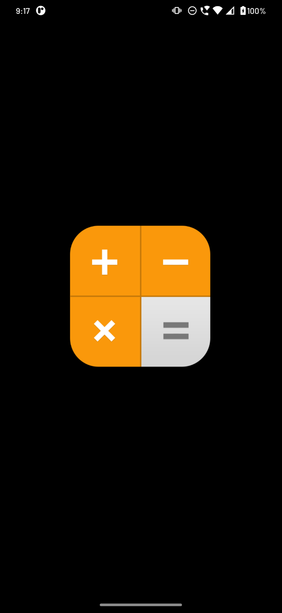
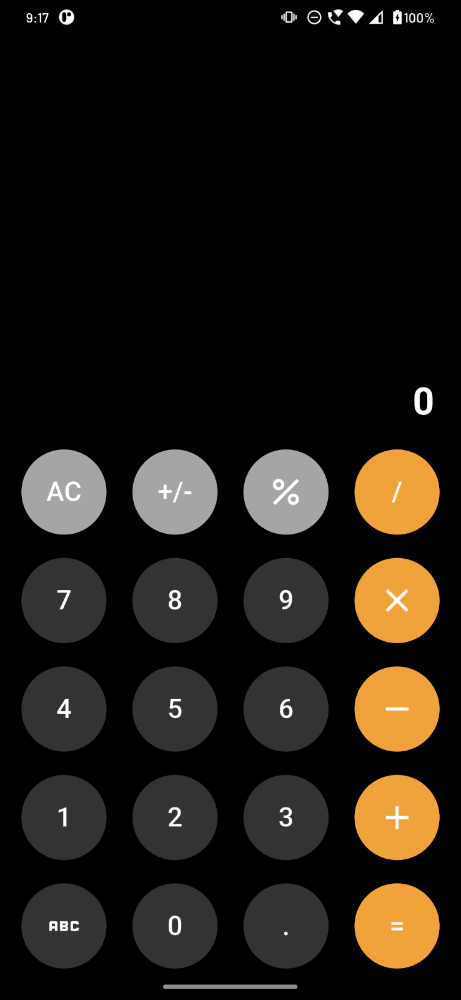
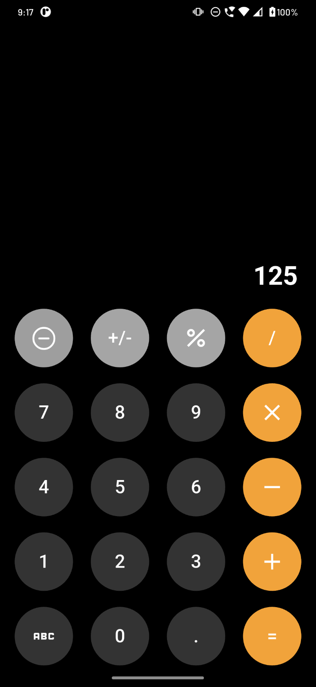

# Calculator App - Flutter Application

## 🧮 Overview
Welcome to the **Calcy(Calculator App)**, a lightweight and beautifully designed calculator built with **Flutter**. This application follows a modular and maintainable project structure, ensuring clarity and scalability.

## 📂 Project Structure

```
lib/
├── components/               # UI components like buttons and dimensions
│   ├── buttons.dart
│   ├── calcy_button.dart
│   └── dimensions.dart
├── constant/                # Constant values and enums
│   ├── arithmetic_operations.dart
│   └── string.dart
├── main.dart                # Entry point of the app
├── model/                   # Data models
│   └── calcy_button_data_model.dart
├── screen/                  # Screens of the app
│   ├── dashboard.dart
│   └── splash.dart
├── style/                   # Custom text styles
│   └── text_style.dart
└── theme/                   # App themes and colors
    ├── colors.dart
    ├── text_theme.dart
    └── theme.dart
```

## 🚀 Features

- Perform basic arithmetic operations (addition, subtraction, multiplication, division).
- Clean and intuitive user interface.
- Reusable and customizable calculator buttons.
- Modular structure following best Flutter practices.
- Splash screen with navigation to the calculator dashboard.

## 🛠️ Tech Stack

- **Flutter**: Cross-platform UI toolkit.
- **Dart**: Language used for development.

## 📲 Getting Started

### 1. Clone the repository
```bash
git clone https://github.com/RohitIdeaUsher/Calcy.git
```

### 2. Navigate to the project directory
```bash
cd calculator_app
```

### 3. Get the dependencies
```bash
flutter pub get
```

### 4. Run the app
```bash
flutter run
```

## 📸 Screenshots






## 📄 License

This project is licensed under the MIT License.
